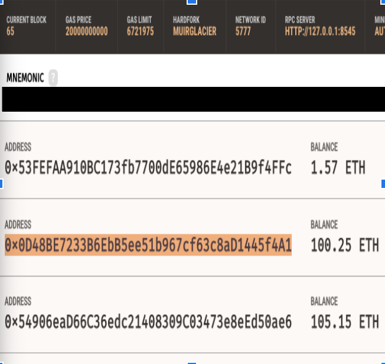
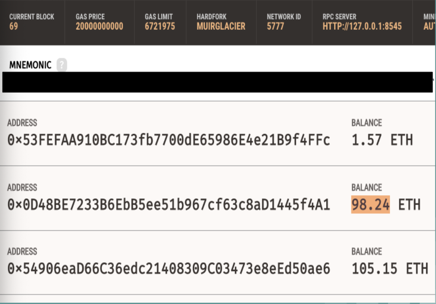

# Decentralized Smart Auto Auction

# Goal:
Create a Smart Contract on the Blockchain that executes the following functions:

* Create Auction
* Register Assets / Register Auctioneers
* Add Bidders
* Transact Highest Bid 
* Execution via Python or Wallet Extension (MetaMask). 
# Problem Solved
Digitize a car auction using ethereum SmartContracts. This allows users to tokenize a nonfungible asset that they own, create/host a digital auction for the asset or token, and collect the proceeds from the auction directly. With this solution SmartContracts replace most of the functionality of a third parties required in a traditional live auction. By replacing third party auction or transaction facilitators with SmartContracts, buyers and sellers can interact directly without the need for a third party and fees associated with traditional auctions. 

# Neccessary Equipment

* Solidity / Python languages:
  * OpenZepplin ERC721- Solidity
  * Web3 - Python
* Ganache Install 
* Remix IDE Install
* MetaMask Install Extension (Crypto Wallet)
* AWS
* Conversational User Interfaces (CUI's)
* Recommended Browser: Firefox (Note: you may encounter complier errors using google chrome or Brave browser.)

# Install Instructions
* Ganache [Ganache Install](https://www.trufflesuite.com/docs/ganache/quickstart) 
* Remix IDE [Remix Install](https://remix.ethereum.org/#optimize=false&runs=200&evmVersion=null&version=soljson-v0.7.4+commit.3f05b770.js)
* MetaMask [MetaMask Download](https://metamask.io/download.html)

# Compile/Deploy SmartContracts
* Open Ganache
* Open remix IDE in your browser (FireFox Recommended)
* Connect MetaMask to the remix IDE and switch to localhost network on MetaMask
* From the "Home" tab in the remix IDE use "open files" to load the SmartContract files into the remix IDE from your device.
* When finished loading the files make sure you have loaded CarAuction.sol, BidderDto.sol, CarDto.sol and ServiceLayer.sol in to the remix IDE
* Switch the compiler version in the remix IDE to version 0.5.5 and compile each contract
* Navigate to Deploy & Run Transactions on the left side of the remix IDE
* Change the environment to Inject Web3, switch to the Ganache wallet address desired and click "Deploy"
* Confirm the transaction to deploy in MetaMask when propted. ServiceLayer is listed under "Deployed Contracts" in the remix IDE
* Congratulations! You are now ready to interact with the ServiceLayer SmartContract!
* Uses OpenZepplin contracts to import ERC721 standard ,which tokenizes non-fungible assets into unique tokens to create secure transactions.
* Uses mapping and events
* Note the various functions like createAuction, registerCar, addBidders, etc. these will be used to register cars as tokens, create an auction, and add bidders to said auction.
* SEE CODE (ServiceLayer.sol)

# Python - Smart Contract
* Imports
* Connect to web3 
* Read in ABI file from Smart Contract
* Plug in smart contract address
* Establish functions and parse in information (i.e. bidder address, vehicle info., bid amount, etc.)
* Watch transaction in Ganache
## Beginning Balance
We will use the address ending in ...f4A1 to transact a bid with the Smart Contract

## Run the Python Code
Run Python code using web3.middleware
* Register Car & Create Auction
* Add Bidder
* Place Bid
* End Auction

## After Running Python 
Notice how account ending ...f4a1 balance dropped to 98.24 ETH

