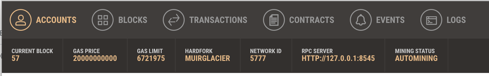

# Decentralized Smart Auto Auction


### Goal:
Non-fungible tokenized auto auction, built with a Smart Contract and deployed to a decentralized blockchain dApp that uses ChatBot functionalities to easily interact with highest bidders.

Create an ethereum smart contract that will digitize the used car market place. 
Allowing anyone with a vehicle to tokenize their vehicle and set the minimum value they would accept in trade.

### Functionality:
Front-end Conversational User Interfaces (CUI's, i.e ChatBot) that collects sellers vehicle information to be auctioned and allows prospective buyers to place bids in a decentralized auction.

### DeFi/Blockchain Technologies used:
* Solidify
* Ganache [Ganache Install](https://www.trufflesuite.com/docs/ganache/quickstart) 
* Remix IDE [Remix Install](https://remix.ethereum.org/#optimize=false&runs=200&evmVersion=null&version=soljson-v0.7.4+commit.3f05b770.js)
* MetaMask [MetaMask Download](https://metamask.io/download.html)
* AWS 
* Conversational User Interfaces (CUI's)

### Initial Setups
Load ```CarAuction.sol``` into the Remix IDE. Follow the above install guide for Ganche and connect to your workspace with primary and child address'. Make sure Ganache RPC Server and MetaMask are connected to Localhost 8545. 




### Deploying SmartContracts
#### Deploying CarAuction contract:
* Using compiler version 0.5.17 and pragma solidity >=0.4.22 <0.6.0, compile the ```CarAuction.sol``` file. 
* Ensure you are using "Injected Web3" when using the deploy & run transaction feature in remix. 
* Copy the account address into the deploy "beneficiary" then DEPLOY. 
* Your MetaMask account will confirm that you want to deploy this contract click CONFIRM. 
* You will then have the option to "View on Etherscan" as well as notice that your contract is listed under the "Deployed Contracts" section in Remix with all the functions written in the contract.  


#### Deploying CarMarket contract: 
* Using compiler version 0.5.17 and pragma solidity ^0.5.0, compile the ```CarMarket.sol``` file.
* Ensure you are using "Injected Web3" when using the deploy & run transaction feature in remix. 
* Make sure to switch to the "CarMarket - browser/CarMarket.sol" then click DEPLOY. 
* Your MetaMask account will confirm that you want to deploy this contract click CONFIRM. 
* You will then have the option to "View on Etherscan" as well as notice that your contract is listed under the "Deployed Contracts" section in Remix.
* You should now have 2 deployed contracts listed; CarAuction and CarMarket with unique contract address'.


### Python
### AWS ChatBot
